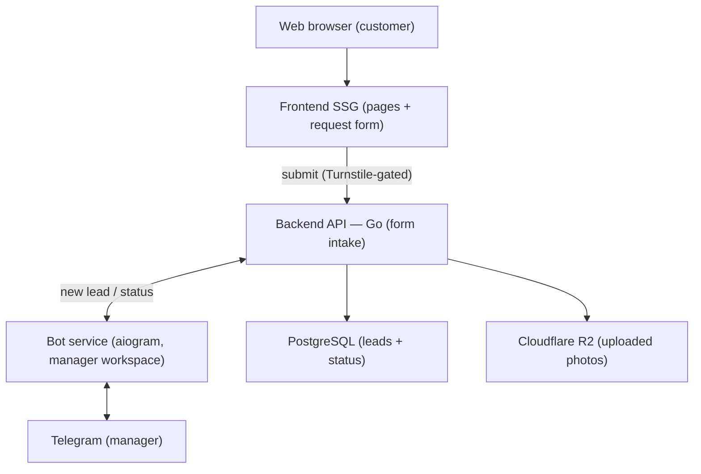

# Dry-Cleaning Lead-Gen Site — Development Plan

*Team-facing technical plan. Design source: the "Clean Company / Luxora" Figma file, repurposed as a clean, image-led marketing site for a dry-cleaning service.*

> **Scope:** This is a marketing site plus a lead-capture form — **not** an online store. There is no payment system and no on-site commerce. Displayed prices are **minimum ranges only**, because every job needs a master's in-person assessment. A customer submits a form (name, phone, city + address, service type, photo, optional description); the submission is delivered to a Telegram bot where a manager reviews it and contacts the customer.

---

## 1. Design & scope analysis

The Luxora template gives a premium, minimal, photography-led look. Repurposed for a service business, the priorities shift from "sell products" to "get found locally and convert visitors into a single form submission."

- **Local SEO is the growth engine.** A service business lives on organic and map discovery, so marketing pages must be server-rendered/statically generated and indexable, with correct metadata and link previews.
- **Content is mostly static.** Services and price ranges change rarely, which makes static generation (SSG/ISR) the natural fit — fast, cheap, and SEO-friendly.
- **The form is the only real conversion.** Everything funnels to one action: submit a request. The form must be frictionless on mobile, validate cleanly, handle a photo upload, and never silently fail.
- **Premium imagery still matters.** Optimized, responsive images keep the brand feel without hurting load speed.

### Surface set
Home/landing, services (with minimum price ranges), how-it-works, about, contact, and the request form (which may be its own page and/or embedded). Plus legal pages: privacy policy and consent text. No catalog, cart, checkout, or accounts.

> Individual frames could not be exported during planning (Figma plan MCP rate limit). Confirm the exact screen list against the file.

---

## 2. Goals (with argumentation)

| # | Goal | Why it matters |
|---|------|----------------|
| G1 | Get found locally, load fast | Organic/local search is how a service business acquires customers; speed and SEO are direct levers. |
| G2 | Frictionless, reliable request form | The single conversion point. It must be easy on mobile, accept a photo, and **never lose a submission**. |
| G3 | Efficient manager workflow in Telegram | The manager triages, tracks status, and contacts customers entirely from the bot — no separate admin needed. |
| G4 | Spam resistance & data protection | A public form wired to Telegram attracts spam and handles personal data (name, phone, address, photo). |
| G5 | Keep it simple and cheap to run | Infrastructure must match a small, low-volume lead site — no premature distributed-systems complexity. |

---

## 3. Stack review

Original proposal: *Go + Kafka + aiogram + Docker + Kubernetes; React or Vue.*

Under the real (lead-gen) scope, the picture simplifies dramatically.

### Drop
- **Payment gateway** — no on-site commerce. Confirmed out.
- **Kafka / any broker** — a single low-volume event ("new lead → notify manager") does not justify a distributed log. A durable DB row + direct notification + retry is simpler and more reliable here.
- **Redis** — no cart, no sessions, nothing worth caching. Anti-spam tooling covers rate-limiting better than a hand-rolled Redis limiter.
- **Kubernetes** — far too heavy. Use Docker Compose on one small VPS, or a static host + a small managed backend.
- **Web admin panel** — the Telegram bot is the manager's admin interface for the MVP.

### Changes role
- **PostgreSQL — keep, for durability not transactions.** It's the source of truth for leads, guaranteeing no request is lost if Telegram is unavailable, and it provides status tracking and history. (SQLite is acceptable at very low volume for an MVP; Postgres is the safer default.)
- **Go backend — keep as a thin intake service.** Validate the form, handle the photo, persist the lead, hand it to the bot. *Honest trade-off:* at this scale a single Python service (FastAPI + aiogram) could do the whole job in one language and one deployment. Keep Go if the team prefers it or wants the separation — it's a preference here, not a requirement.
- **aiogram bot — now the centre of the system.** It's the manager's workspace: receive the lead (photo + details), step it through statuses, and surface the phone number to call.

### Keep
- **Frontend with SSG/SSR.** Lean toward **static generation** (Next.js/Nuxt SSG) since content is mostly static. **Astro** is a strong, lighter alternative for a content site with one interactive island (the form). Image optimization stays in.

### Newly important
- **Anti-spam (first-class):** Cloudflare Turnstile (free) + honeypot field + server-side rate limiting + strict validation. Without this the manager's Telegram fills with junk.
- **No lost leads:** persist to DB first, then notify Telegram, then retry on failure. DB is truth; Telegram is a channel.
- **PII / data protection:** consent checkbox, privacy policy, TLS everywhere, photo hygiene (type/size limits, re-encode, strip EXIF), and a data-retention policy.

### Recommended stack (summary)

| Layer | Recommendation |
|-------|----------------|
| Frontend | Next.js / Nuxt (SSG/ISR) or Astro — SEO, image optimization, design tokens |
| Backend | Go thin intake service (or single Python FastAPI+aiogram service) |
| Datastore | PostgreSQL (SQLite acceptable for MVP) |
| Bot | Python + aiogram — manager workspace |
| Media | Cloudflare R2 (S3-compatible, private bucket); photo bytes forwarded to Telegram in parallel |
| Anti-spam | Cloudflare Turnstile + honeypot + rate limiting |
| Packaging | Docker + Docker Compose (no Kubernetes) |
| Hosting | Static host (Vercel/Netlify/Cloudflare Pages) + small VPS / Fly.io / Railway |
| Observability | Structured logs, error tracking (Sentry), uptime monitor |

---

## 4. Architecture

A deliberately small system. The backend owns the database and is the single source of truth; the bot is the manager's interface to Telegram.

Flow:
1. The customer loads the **static frontend** and submits the **request form** (with a photo), gated by Turnstile.
2. The form posts to the **Go backend**, which validates input, checks the anti-spam token, and (after re-encoding and stripping EXIF) stores the photo to **Cloudflare R2** (private bucket) while writing the lead to **PostgreSQL** as the durable record.
3. The backend hands the lead to the **bot service**, which delivers it to the manager's **Telegram** chat — photo, details, and status buttons.
4. The manager works the lead in Telegram; button taps flow back through the backend to update status in PostgreSQL. The manager contacts the customer by phone.

### Lead lifecycle
`new → contacted → assessed (quoted) → in progress → completed` (plus a `declined` branch). Each transition is a bot button that updates the record.

---

## 5. Work plan (phases)

**Phase 0 — Foundations**
Repo and branching, Docker Compose dev environment, hosting decision, frontend scaffold with design tokens from Figma, Go backend skeleton (config/logging/health), bot skeleton, PostgreSQL schema for leads. *Exit:* full stack runs locally and deploys to staging.

**Phase 1 — Marketing site**
Build the static pages (home, services + minimum price ranges, how-it-works, about, contact), SSG with SEO metadata and link previews, responsive/optimized imagery, and i18n if required (e.g. UA/RU). *Exit:* the public site is complete and indexable.

**Phase 2 — Request form & intake**
Form UI (name, phone, city + address, service type, photo, optional description) with mobile-first UX and client + server validation; anti-spam (Turnstile + honeypot + rate limit); backend intake endpoint; photo handling (type/size limits, re-encode, strip EXIF); persist lead to PostgreSQL. *Exit:* a submission is validated, stored, and durable.

**Phase 3 — Telegram workflow**
Bot delivers new leads to the manager chat (photo + details + status buttons); implement the lead lifecycle and manager actions; ensure reliability (persist-then-notify, retry on failure, no lost leads); show the phone number for easy contact. *Exit:* every submitted lead reliably reaches the manager and is trackable.

**Phase 4 — Hardening & launch**
Privacy policy + consent flow, TLS, secrets management, backups + restore drill, error tracking and uptime monitoring, performance/SEO pass, and a deliberate spam/abuse test. *Exit:* production-ready and launched.

**Phase 5 — Post-launch (optional)**
A lightweight read-only web dashboard for lead history/search, basic analytics, a small CMS to edit services and price ranges without redeploying, and additional languages.

---

## 6. Open decisions to confirm
1. Backend: thin Go intake service vs a single Python (FastAPI + aiogram) service.
2. Datastore: PostgreSQL vs SQLite for MVP (depends on expected volume).
3. Hosting: static host + small managed backend vs single VPS with Docker Compose.
4. Photos: stored in **Cloudflare R2** (private bucket) and forwarded to Telegram in parallel — confirmed. Remaining sub-decision: retention period (set via an R2 lifecycle rule).
5. Telegram target: a shared manager group vs a single manager; assignment workflow.
6. Languages required (UA / RU / EN) — affects content and routing.
7. Exact screen inventory and which pages exist in the Figma file.
