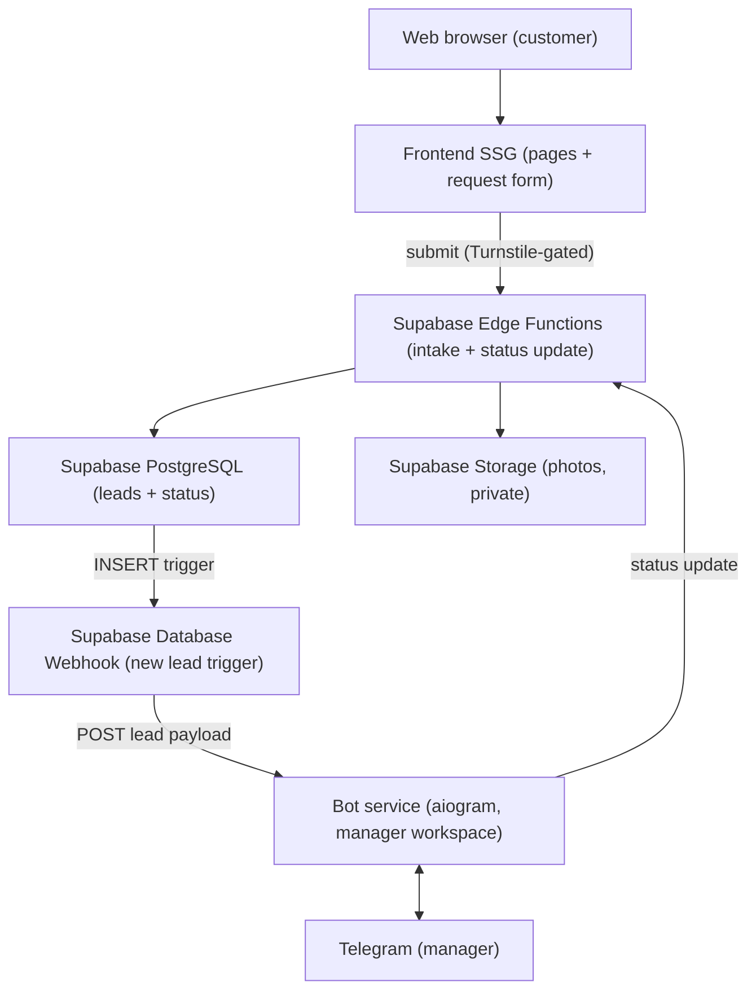

# Dry-Cleaning Lead-Gen Site — Development Plan

*Team-facing technical plan. Design source: the "Clean Company / Luxora" Figma file, repurposed as a clean, image-led marketing site for a dry-cleaning service.*

> **Scope:** This is a marketing site plus a lead-capture form — **not** an online store. There is no payment system and no on-site commerce. Displayed prices are **minimum ranges only**, because every job needs a master's in-person assessment. A customer submits a form (name, phone, city + address, service type, photo, optional description); the submission is delivered to a Telegram bot where a manager reviews it and contacts the customer.

---

## 1. Design & scope analysis

The Luxora template gives a premium, minimal, photography-led look. Repurposed for a service business, the priorities shift from "sell products" to "get found locally and convert visitors into a single form submission."

- **Local SEO is the growth engine.** A service business lives on organic and map discovery, so marketing pages must be server-rendered/statically generated and indexable, with correct metadata and link previews.
- **Content is mostly static.** Services and price ranges change rarely, which makes static generation (SSG/ISR) the natural fit — fast, cheap, and SEO-friendly.
- **The form is the only real conversion.** Everything funnels to one action: submit a request. The form must be frictionless on mobile, validate cleanly, handle a photo upload, and never silently fail.
- **Premium imagery still matters.** Optimized, responsive images keep the brand feel without hurting load speed.

### Surface set
Home/landing, services (with minimum price ranges), how-it-works, about, contact, and the request form (which may be its own page and/or embedded). Plus legal pages: privacy policy and consent text. No catalog, cart, checkout, or accounts.

> Individual frames could not be exported during planning (Figma plan MCP rate limit). Confirm the exact screen list against the file.

---

## 2. Goals (with argumentation)

| # | Goal | Why it matters |
|---|------|----------------|
| G1 | Get found locally, load fast | Organic/local search is how a service business acquires customers; speed and SEO are direct levers. |
| G2 | Frictionless, reliable request form | The single conversion point. It must be easy on mobile, accept a photo, and **never lose a submission**. |
| G3 | Efficient manager workflow in Telegram | The manager triages, tracks status, and contacts customers entirely from the bot — no separate admin needed. |
| G4 | Spam resistance & data protection | A public form wired to Telegram attracts spam and handles personal data (name, phone, address, photo). |
| G5 | Keep it simple and cheap to run | Infrastructure must match a small, low-volume lead site — no premature distributed-systems complexity. |

---

## 3. Stack review

Original proposal: *Go + Kafka + aiogram + Docker + Kubernetes; React or Vue.*

Under the real (lead-gen) scope, the picture simplifies dramatically.

### Drop
- **Payment gateway** — no on-site commerce. Confirmed out.
- **Kafka / any broker** — a single low-volume event ("new lead → notify manager") does not justify a distributed log. A durable DB row + Database Webhook + retry is simpler and more reliable here.
- **Redis** — no cart, no sessions, nothing worth caching. Anti-spam tooling covers rate-limiting better than a hand-rolled Redis limiter.
- **Kubernetes** — far too heavy. The bot is the only custom-deployed service.
- **Web admin panel** — the Telegram bot is the manager's admin interface for the MVP.
- **Go backend / custom intake server** — replaced by Supabase Edge Functions; no server infrastructure to provision or operate for the intake path.
- **Cloudflare R2** — replaced by Supabase Storage (private bucket, S3-compatible, co-located with the database).

### Changes role
- **PostgreSQL → Supabase Managed PostgreSQL.** Same durability guarantee (source of truth for leads), now fully managed. No provisioning, no backups to configure manually, row-level security enforced at the DB layer.
- **Intake logic → Supabase Edge Functions (Deno/TypeScript).** Validate form input, verify Turnstile token, strip EXIF, upload photo to Supabase Storage, write the lead record. Runs at the edge close to the user; no custom server to maintain.
- **Lead notification → Supabase Database Webhook.** Fires on INSERT to the leads table and POSTs to the bot webhook endpoint — decouples storage from delivery without a message broker.
- **aiogram bot — still the centre of the manager's workflow.** Receives the Database Webhook POST (new lead: photo + details + status buttons), handles callback queries from the manager, and writes status updates back via the Supabase client or a status-update Edge Function.

### Keep
- **Frontend with SSG/SSR.** Lean toward **static generation** (Next.js/Nuxt SSG) since content is mostly static. **Astro** is a strong, lighter alternative for a content site with one interactive island (the form). Image optimization stays in.

### Newly important
- **Anti-spam (first-class):** Cloudflare Turnstile (free) + honeypot field + rate limiting inside the Edge Function + strict validation. Without this the manager's Telegram fills with junk.
- **No lost leads:** Edge Function writes to Supabase PostgreSQL first; Database Webhook triggers Telegram delivery after. DB is truth; Telegram is a channel. Edge Functions have built-in retry.
- **PII / data protection:** consent checkbox, privacy policy, TLS everywhere (Supabase enforces TLS), photo hygiene (type/size limits, re-encode, strip EXIF before Storage upload), data-retention policy via Supabase Storage lifecycle rules.
- **Supabase Row-Level Security (RLS):** enable RLS on the leads table from day one; only the service-role key (used by Edge Functions and the bot) can write or read leads.

### Recommended stack (summary)

| Layer | Recommendation |
|-------|----------------|
| Frontend | Next.js / Nuxt (SSG/ISR) or Astro — SEO, image optimization, design tokens |
| Backend | Supabase Edge Functions (Deno/TypeScript) — form intake, validation, photo handling, status updates |
| Datastore | Supabase Managed PostgreSQL — leads table, status tracking, RLS enforced |
| Bot | Python + aiogram — manager workspace; triggered via Supabase Database Webhook |
| Media | Supabase Storage (private bucket, S3-compatible); EXIF stripped before upload |
| Anti-spam | Cloudflare Turnstile + honeypot + rate limiting inside Edge Function |
| Packaging | Docker only for the aiogram bot service; everything else is managed/serverless |
| Hosting | Static host (Vercel/Netlify/Cloudflare Pages) + Supabase project + bot on Fly.io / Railway |
| Observability | Supabase dashboard logs + Sentry for Edge Functions and bot, uptime monitor |

---

## 4. Architecture

A deliberately small system. Supabase is the managed backend layer — no custom server infrastructure for the intake path. Edge Functions handle form ingestion; Database Webhooks decouple storage from delivery.

Flow:
1. The customer loads the **static frontend** and submits the **request form** (with a photo), gated by Turnstile.
2. The form posts to a **Supabase Edge Function**, which validates input, verifies the Turnstile token, strips EXIF from the photo, uploads it to **Supabase Storage** (private bucket), and writes the lead to **Supabase PostgreSQL** as the durable record.
3. A **Supabase Database Webhook** fires on the new leads row and POSTs to the **aiogram bot** webhook endpoint, which delivers it to the manager's **Telegram** chat — photo, details, and status buttons.
4. The manager works the lead in Telegram; button taps flow back to the bot, which calls a status-update **Edge Function** (or the Supabase client directly) to update the record in PostgreSQL. The manager contacts the customer by phone.

### Lead lifecycle
`new → contacted → assessed (quoted) → in progress → completed` (plus a `declined` branch). Each transition is a bot button that updates the record.

---

## 5. Work plan (phases)

**Phase 0 — Foundations**
Repo and branching; create Supabase project (Managed PostgreSQL, Storage bucket with private ACL, RLS enabled); leads table schema and migration; Edge Function scaffold (hello-world health check deployed); Database Webhook configured to POST to bot webhook URL; bot skeleton deployed on Fly.io / Railway; frontend scaffold with design tokens from Figma. *Exit:* full stack wired end-to-end locally and on staging — a dummy form POST reaches the Edge Function, writes a row, fires the Webhook, and the bot echoes it in Telegram.

**Phase 1 — Marketing site**
Build the static pages (home, services + minimum price ranges, how-it-works, about, contact), SSG with SEO metadata and link previews, responsive/optimized imagery, and i18n if required (e.g. UA/RU). *Exit:* the public site is complete and indexable.

**Phase 2 — Request form & intake**
Form UI (name, phone, city + address, service type, photo, optional description) with mobile-first UX and client-side validation; Supabase Edge Function for server-side validation, Turnstile verification, honeypot check, rate limiting, EXIF stripping, photo upload to Supabase Storage, and lead INSERT to PostgreSQL. *Exit:* a submission is validated, stored durably in Supabase, and the photo is in the private Storage bucket.

**Phase 3 — Telegram workflow**
Database Webhook delivers new leads to the bot; bot posts photo + details + status buttons to the manager's Telegram chat; implement the lead lifecycle (status callbacks → Edge Function → DB update); ensure reliability (INSERT before Webhook fires, built-in Edge Function retry); surface phone number for easy contact. *Exit:* every submitted lead reliably reaches the manager and is trackable through to completion.

**Phase 4 — Hardening & launch**
Privacy policy + consent flow; TLS end-to-end (Supabase enforces it, bot host TLS); secrets management (Supabase Vault / environment variables, no keys in repo); Supabase PITR backup verification; Sentry integration for Edge Functions and bot; performance/SEO pass; Storage lifecycle rule for photo retention; deliberate spam/abuse test. *Exit:* production-ready and launched.

**Phase 5 — Post-launch (optional)**
A lightweight read-only web dashboard for lead history/search, basic analytics, a small CMS to edit services and price ranges without redeploying, and additional languages.

---

## 6. Open decisions to confirm
1. Bot hosting: Fly.io vs Railway vs small VPS — the only custom-deployed service; choose based on team familiarity and cost.
2. Photo retention period — set as a Supabase Storage lifecycle rule (e.g., delete originals after 90 days once the lead is closed).
3. Telegram target: a shared manager group vs a single manager; assignment workflow if multiple managers.
4. Languages required (UA / RU / EN) — affects content, routing, and i18n library choice.
5. Exact screen inventory and which pages exist in the Figma file.

> **Resolved:** backend language (Edge Functions / Deno), datastore (Supabase PostgreSQL), media storage (Supabase Storage), lead notification mechanism (Database Webhook), hosting topology (static host + Supabase + bot platform).
